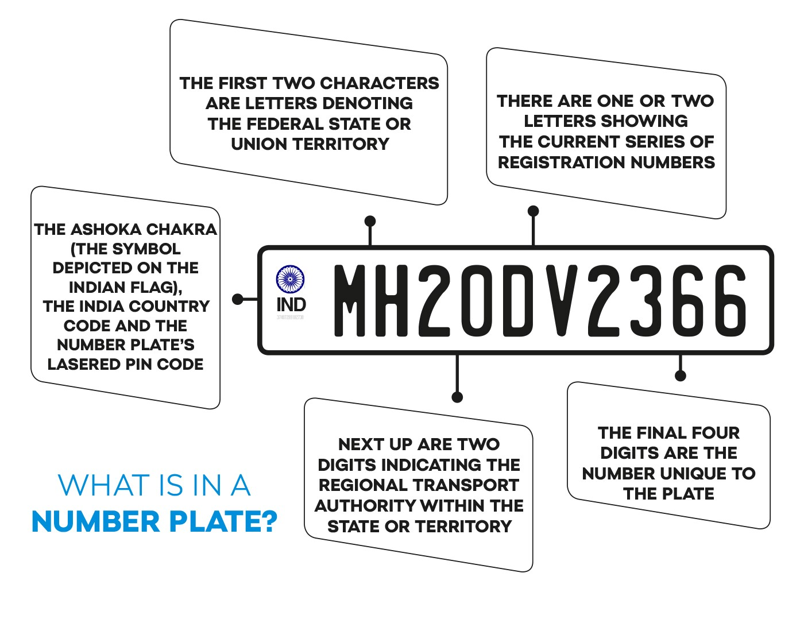
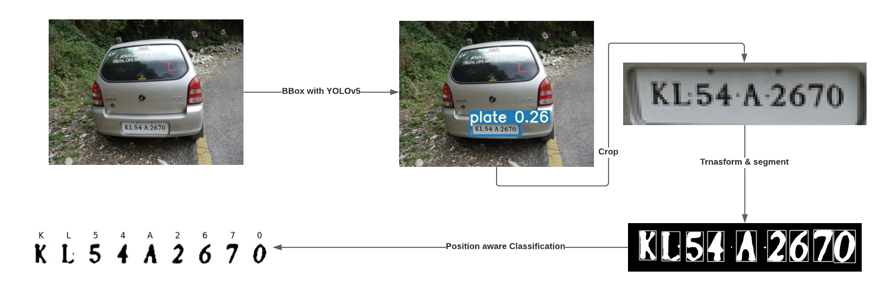
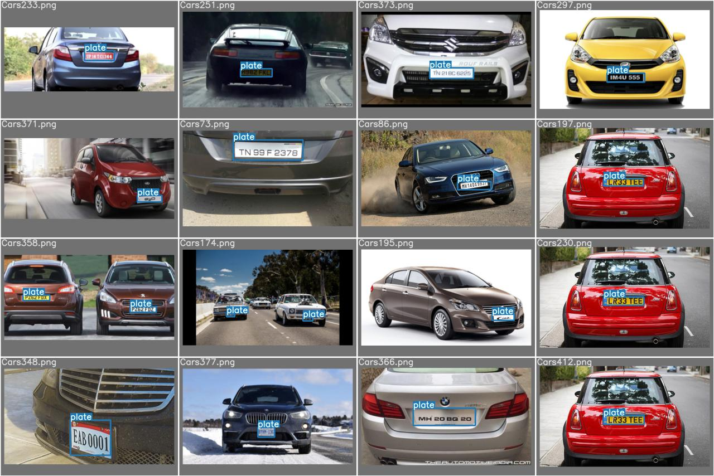

# Automatic-Licence-Plate-Recognition

> With the ever-increasing need for transportation globally, the amount of vehicles on the road is piling everyday. The need for automatic traffic monitoring has never been so high. Your task is to implement an automatic number plate recognizer in an **unconstrained condition** that considers occlusion, poor quality of images, and **other spatial variations** in image data.
<br>

<!--  -->


## Approach & Optimizations

The whole pipeline is a 3 stage process:

- License Plate Detection from _unconstrained_ environment images using YOLOv5
- Segmentation of Characters from cropped license plate image using openCV
- character Recognition of Individual contours using a CNN network

A [YOLOv5](#acknowledgements) is used to predict the bounding box around License plate. Then the cropped license plate image is processed using:

- noise removal, extra lines filtering, Adaptive histogram equalization (CLAHE)
- a four point perspective transform to handle different viewing angles

A rule based character segmentation is performed using contours. We add several checks over expected dimensions of charcter blobs to select only those contours that are characters. Then the segmented characters are passed through a CNN classifier for recognition

## Run Locally

Clone the project

```bash
  git clone https://github.com/iharsh17/Automatic-Licence-Plate-Recognition.git
```

Go to the project directory

```bash
  cd Automatic-Number-Plate-Recognition
```

Install dependencies

```bash
  pip install -r requirements.txt
```

Make predictions

```bash
  python src/main.py --image_path path/to/licensePlate
```

## Procedure


<br>
<br>

## Training Metrics & Snapshots



## Acknowledgements

- [Ultralytics YOLOv5](https://github.com/ultralytics/yolov5)

## Our Team:
<table>
<tr>
      <td align="center"><a href="https://github.com/iharsh17"><br /><sub><b>Harsh Raj</b></sub></a></td>
      <td align="center"><a href="https://github.com/carrotBoiii"><br /><sub><b>Swagat Nayak</b></a></td>
      
</tr>
</table>